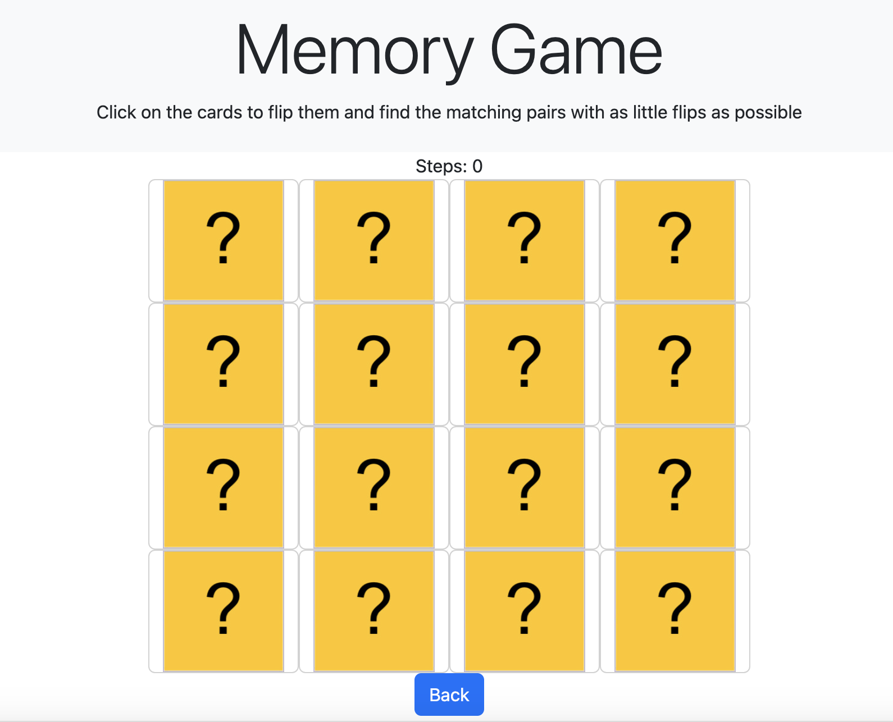
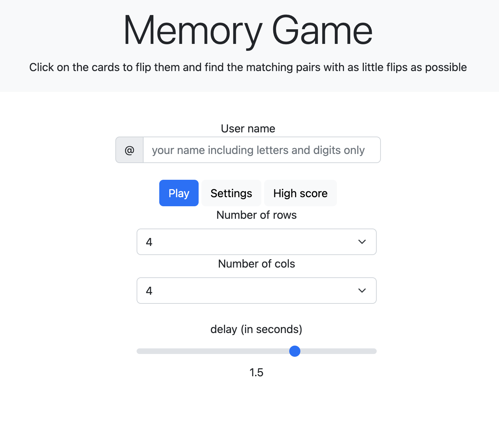
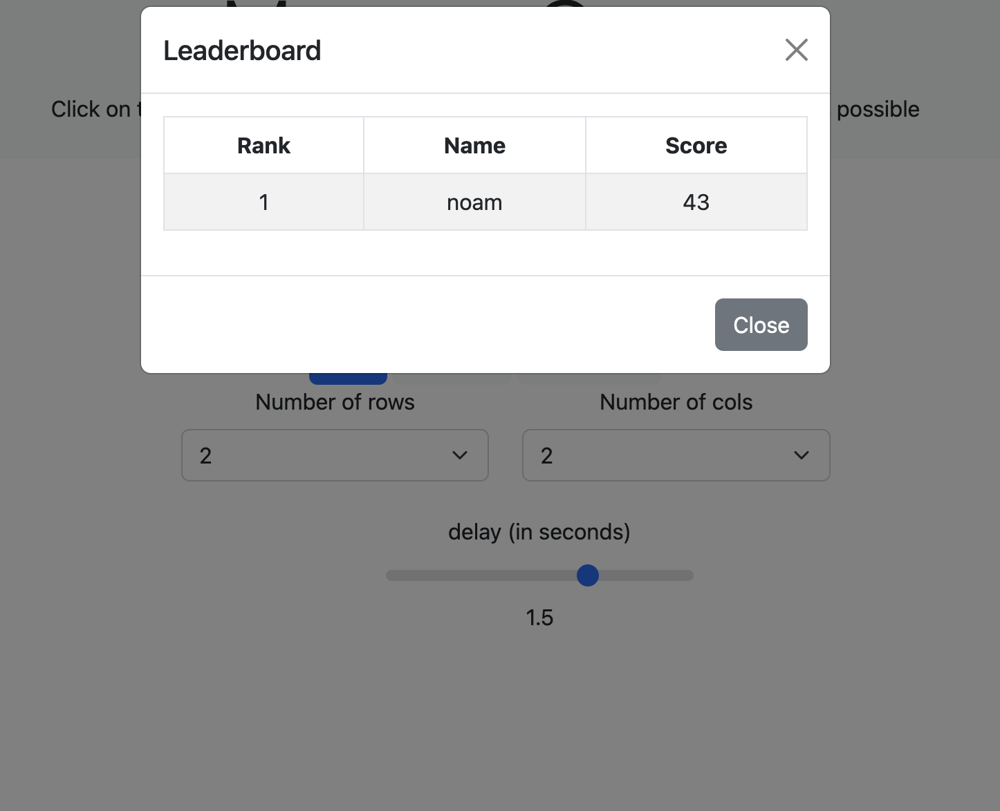

# Memory Match Game in JavaScript 🧠

## Author: Noam Mirjani

Welcome to the Memory Match Game! This engaging JavaScript-based game allows you to challenge your memory skills. Customize the grid size by selecting the number of rows and columns, then flip cards to find matching pairs. The game also keeps track of your score and provides a high-score leaderboard where you can enter your name.

  

### Try it yourself 
[Click here to try the game](https://noammirjani.github.io/memory-game/html/index.html)

### Table of Contents
- [Usage](#usage)
- [Dependencies](#dependencies)
- [License](#license)

### Usage
To enjoy the game, follow these simple steps:

1. Open the `index.html` file in a web browser.
2. Select the desired number of rows and columns for the game grid.
3. Enter your name to personalize the gaming experience.
4. Start playing by clicking on cards to flip them and match pairs.
5. After completing the game, your score will be displayed.
6. Optionally, enter your name to view the high scores on the leaderboard.

   
  

### Dependencies
This project relies on the following external libraries:

- **Bootstrap:** Used for styling and layout.

### License

Feel free to enhance and customize the game to suit your preferences. Happy gaming! 🎮
